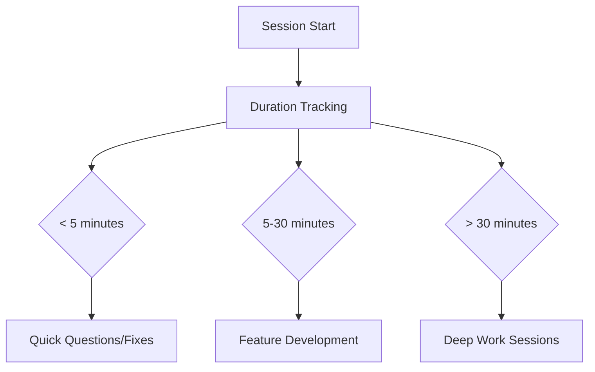
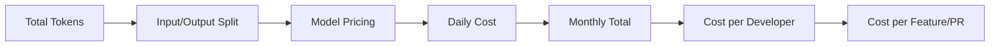
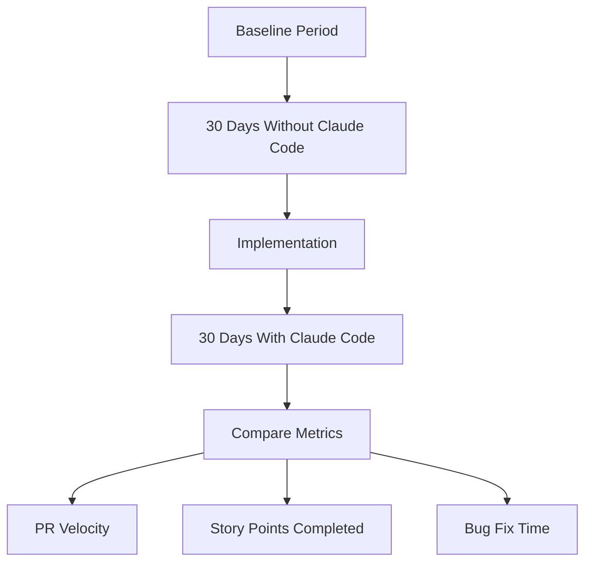
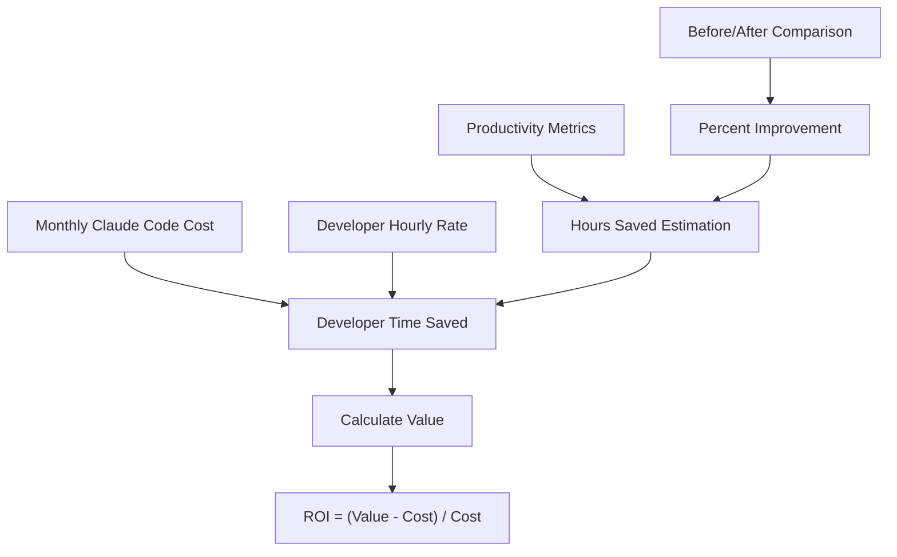

# A quickstart to measuring the return on your Claude Code investment

By: Kashyap Coimbatore Murali

## Executive summary

Coding tools like Claude Code promise to attach jetpacks to developers, and the data backs it up. With 79% of Claude Code conversations being automation tasks, teams are seeing real productivity gains that go far beyond simple code completion. During the June 12th cloud outage, I realized how dependent I'd become on Claude Code - even for fixing simple apostrophe errors in convoluted cURL commands.

Your team probably already understands the need for developer productivity tools. What you need now is telemetry to answer the important questions: Are developers actually using it? Which teams are getting the most value? What's our real cost per feature or bug fix?

This guide walks you through setting up observability with Claude Code using OpenTelemetry metrics. You'll get the complete setup - from Prometheus configuration to automated reporting - so your engineering leadership can make data-driven decisions about your AI tooling investment.

## Setting up your measurement infrastructure

### Quick Verification

Before diving into Prometheus, let's verify telemetry is working:

```bash
export CLAUDE_CODE_ENABLE_TELEMETRY=1
export OTEL_METRICS_EXPORTER=console
claude -p "hello world"
```

**You should see output like this:**
```
=== Resource Attributes ===
{ 'service.name': 'claude-code', 'service.version': '1.0.17' }
===========================

{
  descriptor: {
    name: 'claude_code.cost.usage',
    type: 'COUNTER',
    description: 'Cost of the Claude Code session',
    unit: 'USD',
    valueType: 1
  },
  dataPointType: 3,
  dataPoints: [
    {
      attributes: {
        'user.id': '7b673f5715f2da49af2cdd341e0cad17fb3274f32d4ceed00d57d53da4e76fb2',
        'session.id': '092d99fc-ac17-4ee7-b310-57d387777c91',
        'model': 'claude-4-sonnet-20250514'
      },
      value: 0.000297
    }
  ]
}
```

### Prometheus Setup

For actual ROI measurement, you need Prometheus. Console output is just debugging - Prometheus gives you dashboards, historical data, and executive-ready visualizations.

First, grab the configuration files:

```bash
# Clone the configuration repo
git clone https://github.com/your-org/claude-code-prometheus-config
cd claude-code-prometheus-config

# Or use the files in this repository
cd prometheus-config
docker-compose up -d
```

Configure Claude Code to send metrics to Prometheus:

```bash
# Enable telemetry
export CLAUDE_CODE_ENABLE_TELEMETRY=1

# Configure OTLP exporter  
export OTEL_METRICS_EXPORTER=otlp
export OTEL_EXPORTER_OTLP_PROTOCOL=grpc
export OTEL_EXPORTER_OTLP_ENDPOINT=http://localhost:4317

# Optional: Set authentication if required
# export OTEL_EXPORTER_OTLP_HEADERS="Authorization=Bearer your-token"

# Run Claude Code
claude
```

Common infrastructure endpoints:
- **Local development**: `http://localhost:4317`
- **Kubernetes**: `http://otel-collector.monitoring.svc.cluster.local:4317`
- **AWS**: Your Application Load Balancer endpoint
- **DataDog**: `https://otlp.datadoghq.com`

### Key Prometheus Queries

Once data is flowing, these queries give you the insights you need:

```promql
# Total cost across all sessions
sum(claude_code_cost_usage_USD_total)

# Token usage by type (input/output)
sum(claude_code_token_usage_tokens_total) by (type)

# Token usage by user email
sum(claude_code_token_usage_tokens_total) by (user_email)

# Cost by model type
sum(claude_code_cost_usage_USD_total) by (model)

# Rate of token consumption over time (requires multiple data points)
rate(claude_code_token_usage_tokens_total[5m])
```

**Example query results (from real telemetry data across 6 sessions):**
```promql
# Query 1: sum(claude_code_cost_usage_USD_total)
{} 0.43

# Query 2: sum(claude_code_token_usage_tokens_total) by (type)
{type="input"} 751
{type="output"} 1863
{type="cacheCreation"} 2136
{type="cacheRead"} 78465

# Query 3: sum(claude_code_token_usage_tokens_total) by (user_email)  
{user_email="user@company.com"} 83215

# Query 4: sum(claude_code_cost_usage_USD_total) by (model)
{model="claude-opus-4-20250514"} 0.429
{model="claude-3-5-haiku-20241022"} 0.0006

# Query 5: rate(claude_code_token_usage_tokens_total[5m])
{type="input"} 2.5
{type="output"} 6.2
{type="cacheRead"} 261.5
```


*Prometheus interface showing claude_code_cost_usage_USD_total time series data with detailed metric breakdown and $0.107 tooltip value*

 
*Grafana visualization comparing Claude Code costs between Haiku and Opus models over time, showing usage patterns and cost distribution*

## Understanding Usage and Cost

Let's start with what Claude Code actually costs. Unlike fixed subscription tools, Claude Code has variable costs based on usage patterns.
### Token Usage Patterns

The `claude_code.token.usage` metric breaks down by:
- **Input tokens**: Code you provide for analysis
- **Output tokens**: Code Claude generates
- **Model type**: Different models have different costs

**Usage Patterns by Plan Type:**

**Subscription Users (Pro/Max):**
- **Claude Pro**: ~45 prompts per 5-hour session, predictable $20/month
- **Claude Max 5x**: ~225 prompts per 5-hour session, $100/month for heavy development
- **Claude Max 20x**: ~900 prompts per 5-hour session, $200/month for intensive workflows

**API Users (Pay-per-token) - Real Usage Patterns:**

**Complex Development Work** (Opus 4 with "ultrathink"):
- Architecture reviews, performance analysis, security audits
- 1,000-5,000 input tokens, 2,000-8,000 output tokens  
- $0.075-0.34 per complex query
- Heavy cache usage (39:1 read:creation ratio saves significant cost)

> **Pro tip**: "ultrathink" triggers Claude's maximum thinking budget for complex analysis. The hierarchy is: "think" < "think hard" < "think harder" < "ultrathink" - each level gives Claude more computation time for thorough evaluation. See Claude Code's [best practices doc](https://www.anthropic.com/engineering/claude-code-best-practices) for more info!

**Simple Development Tasks** (Haiku):
- Quick questions, simple functions, code snippets
- 200-500 input tokens, 10-50 output tokens
- $0.0001-0.0003 per simple query

*Real examples: Complex architectural analysis cost $0.34, simple "hello world" cost $0.0003*

### Cost Comparison

| Plan Type | Monthly Cost | Usage Limits | Best For |
|-----------|--------------|--------------|----------|
| **Claude Pro** | $20/month* | ~45 messages/5hrs | Individual developers, predictable cost |
| **Claude Max 5x** | $100/month | ~225 messages/5hrs | Heavy users, 50-200 Claude Code prompts/5hrs |
| **Claude Max 20x** | $200/month | ~900 messages/5hrs | Power users, 200-800 Claude Code prompts/5hrs |
| **API Usage** | Variable by model | Pay-per-token | Custom integrations, batch processing |

*Annual discounts may be available for subscription plans.

**API Pricing by Model:**
- **Haiku 3**: $0.25/$1.25 per million input/output tokens (fastest, cheapest)
- **Sonnet 4**: $3.00/$15.00 per million tokens (balanced performance)
- **Opus 4**: $15.00/$75.00 per million tokens (most capable)

**Pro tip**: For regular Claude Code usage, Max subscriptions are often more predictable than API costs. Individual developers can't control API optimizations like prompt caching, making subscriptions simpler for daily development work.

**Note**: Telemetry may require a clean Claude Code installation if you experience hanging. See [troubleshooting.md](troubleshooting.md) for solutions.


*Comprehensive Grafana dashboard showing Claude Code cost by model, cost by user, and token usage metrics across multiple visualization panels* 

### Session Duration Analysis

Understanding how long developers stay in Claude Code sessions helps identify engagement patterns:



### Monthly Cost Calculation



## Understanding the Return

Measuring developer productivity isn't straightforward, but Claude Code provides several useful metrics for tracking impact on your development workflows.

### Available Productivity Metrics

| Metric | What It Measures | Reliability & Interpretation |
|--------|------------------|------------------------------|
| `claude_code.pull_request.count` | PRs created during Claude sessions | **High reliability** - Strong indicator of feature completion and development velocity |
| `claude_code.commit.count` | Commits made with Claude assistance | **Medium reliability** - Varies by team commit practices; some teams commit frequently, others in large batches |
| `claude_code.lines_of_code.count` | Code additions/modifications | **Low reliability** - Lines of code can be misleading; refactoring may reduce LOC while improving quality |

**Key insight**: PR count is the most reliable productivity metric as it represents completed, reviewable work units regardless of team practices.
### Before/After Analysis

The most compelling ROI story comes from before/after comparisons. Track these metrics for 30 days before introducing Claude Code, then compare:



Based on Anthropic's research on [software development impact](https://www.anthropic.com/research/impact-software-development):
- **79% of Claude Code conversations are automation tasks** (vs 49% on Claude.ai)
- **35.8% are feedback loop interactions** - iterative development and debugging
- **43.8% are directive conversations** - direct task completion
- **JavaScript/TypeScript dominates usage** at 31% of queries, followed by HTML/CSS (28%) and Python (14%)


Let your organization define what productivity means. Claude Code just provides the measurement tools.

## Understanding ROI

Now that you have cost and productivity metrics, you can calculate ROI. We won't prescribe specific formulas - your organization knows your developer costs and productivity baselines better than anyone.

### Key Metric Combinations

```promql
# Total cost for analysis period
sum(claude_code_cost_usage_USD_total)

# Total tokens consumed by type
sum(claude_code_token_usage_tokens_total) by (type)

# Cost per user
sum(claude_code_cost_usage_USD_total) by (user_email)

# Average cost per session (when session metrics are available)
sum(claude_code_cost_usage_USD_total) / count(claude_code_cost_usage_USD_total)
```

**Example results for ROI analysis (real data from 6 sessions):**
```promql
# Total cost for analysis period: $0.43 across 6 sessions
sum(claude_code_cost_usage_USD_total) = 0.43

# Tokens by type: Shows massive cache usage value
{type="input"} 751
{type="output"} 1863  
{type="cacheCreation"} 2136
{type="cacheRead"} 78465

# Cost breakdown by model complexity
{model="claude-opus-4-20250514"} 0.429  # Complex "ultrathink" queries
{model="claude-3-5-haiku-20241022"} 0.0006  # Simple queries

# Cache efficiency: 78k cache reads vs 2k cache creation (39:1 ratio)
# Average cost per session: $0.43 / 6 = $0.072
```
### ROI Calculation Flow



Your organization can use these metrics to calculate ROI based on your developer costs and productivity baselines. The key is consistent measurement over time.

## Brownie Points: Automated Reporting

Here's where it gets fun. You can ask Claude to generate reports combining your telemetry data with project management metrics.

### Setting up Linear MCP Integration

Claude Code has built-in MCP support. Set up the Linear MCP server using the CLI:

```bash
# Add Linear MCP server to Claude Code
claude mcp add linear -s user -- npx -y mcp-remote https://mcp.linear.app/sse

# Verify it's working
claude mcp list

# Restart Claude Code to activate the integration
```

Alternatively, you can configure it directly in your `.claude.json` file:

```json
{
  "mcpServers": {
    "linear": {
      "type": "stdio", 
      "command": "npx",
      "args": ["-y", "mcp-remote", "https://mcp.linear.app/sse"]
    }
  }
}
```

### Generating Automated Reports

We've created a comprehensive prompt template for generating reports. Here's a simplified example:

```bash
claude -p "Using the Linear MCP, analyze our team's velocity for the last sprint and combine with these Claude Code metrics:

{
  \"claude_code_sessions\": 42,
  \"total_cost\": 103.45,
  \"avg_session_duration\": \"28.5 minutes\",
  \"tool_acceptance_rates\": {\"Edit\": 0.81, \"MultiEdit\": 0.92}
}

Generate a comprehensive productivity report with visualizations."
```

**Dynamic Metric Fetching Example:**

```bash
#!/bin/bash
# fetch-claude-metrics.sh - Automate report generation with live data

# Fetch metrics from Prometheus
TOTAL_COST=$(curl -s "http://localhost:9090/api/v1/query?query=sum(claude_code_cost_usage_USD_total)" | jq -r '.data.result[0].value[1] // "0"')
INPUT_TOKENS=$(curl -s "http://localhost:9090/api/v1/query?query=sum(claude_code_token_usage_tokens_total{type=\"input\"})" | jq -r '.data.result[0].value[1] // "0"')
OUTPUT_TOKENS=$(curl -s "http://localhost:9090/api/v1/query?query=sum(claude_code_token_usage_tokens_total{type=\"output\"})" | jq -r '.data.result[0].value[1] // "0"')

# Generate report with live data
claude -p "Using the Linear MCP, analyze our team's velocity and combine with these live Claude Code metrics:

{
  \"total_cost\": $TOTAL_COST,
  \"input_tokens\": $INPUT_TOKENS,
  \"output_tokens\": $OUTPUT_TOKENS,
  \"cost_per_token\": $(echo "$TOTAL_COST / ($INPUT_TOKENS + $OUTPUT_TOKENS)" | bc -l)
}

Generate a comprehensive productivity report with visualizations."
```

For the complete prompt with all metrics and detailed instructions, see [report-generation-prompt.md](report-generation-prompt.md).

### Sample Report Output

Using the prompt template above, Claude generates comprehensive reports like this:

**Executive Summary**
> This week's analysis shows a 17% improvement in commit velocity for teams using Claude Code effectively. Total cost was $103.45 across 15 active Linear issues.

**Key Insights Generated**
- Development velocity improved 17% for teams with high Claude Code adoption
- Average session duration of 28.5 minutes falls within optimal productivity range
- MultiEdit tool shows 92% acceptance rate but low usage - opportunity for training
- Bug fix tickets (KAS-10, KAS-14) would benefit from increased MultiEdit usage

**What the Report Includes:**
- Mermaid visualizations for tool usage, costs, and productivity metrics
- Real Linear ticket analysis (KAS-10 through KAS-15)
- Actionable recommendations based on actual usage patterns
- Cost breakdowns and ROI calculations

For the complete generated report with all visualizations and metrics, see [sample-report-output.md](sample-report-output.md).

## Organization Deployment

Rolling out telemetry across your organization is straightforward with managed settings.

### Managed Settings Configuration

Create a `managed-settings.json` file:

```json
{
  "telemetry": {
    "enabled": true,
    "endpoint": "https://your-otel-collector.company.com:4317",
    "headers": {
      "Authorization": "Bearer ${OTEL_TOKEN}"
    }
  },
  "exporters": {
    "metrics": "otlp",
    "logs": "otlp"
  }
}
```

Deploy via your MDM solution or configuration management tool. Users can't disable telemetry, ensuring consistent data collection.

For detailed deployment options, see the [Claude Code deployment documentation](https://docs.anthropic.com/en/docs/claude-code/deployment).

## Conclusion

Measuring Claude Code's ROI doesn't have to be complicated. The key steps are:

1. **Enable telemetry immediately** - Even console output gives you basic insights
2. **Set up Prometheus for real measurement** - Dashboards and queries unlock the full picture  
3. **Track both cost and productivity metrics** - You need both sides of the ROI equation
4. **Use automated reporting for regular reviews** - Let Claude generate the insights from your data